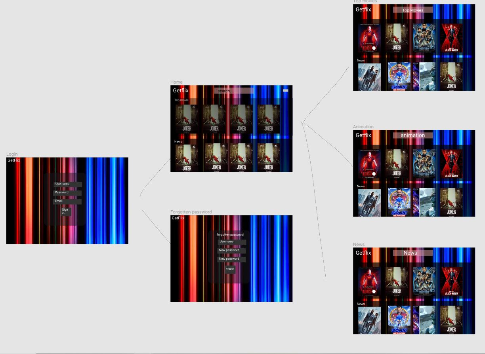

# GetFlix
Type of challenge: **Team work**  
Duration : **10 days**  
Team challenge: **4**  

# **Welcome to our Getflix streaming plateform project.**  
  

| ++ | + | The Team | + | ++ |
| :-----: | :-----: | :-----: | :-----: | :-----: |
| Noémie | Louis | - | Soufiane | Eugenie | 

## Introduction

Ce projet à pour but de tester nos nouvelles connaissance en php et mysql ainsi que revoir les bases tels que bootstrap 4 ,CSS et Javascript.

le challenge consiste à creer une plateforme de streaming contenant des bandes annonces.

Lien du repo initial:[ICI](https://github.com/becodeorg/BXL-Swartz-3-21).

## Languages Utilisés

* HTML5
* CSS3
* PHP,Mysql
* JS
* Bootstrap4

## Lien vers notre site 

BLURFLIX: [ICI](http://blurflix.rf.gd/).
## Avancé du projet

* 24/08/2020 : création d'une maquette via Figma,recherche d'un hébergeur pour PHP,recherche sur la mise en place du système de session ,Mise en place d'un trello et recherche sur la mise en place de la méthode de filtrage la plus adaptée .
* 25/08/2020 : création de la première page du formulaire, recherche sur authentification et système de session et partage de database.
* 26/08/2020 : creation des form d'enregistrement et d'oubli de mot de passe, creation de la home page, session register & lien avec le frontend.
* 27/08/2020 : avancement du frontend au niveau de la home page , recherche sur le système de filtrage via php , remplissage de la database.
* 28/08/2020 : récupération des lien des trailer des films et séries, avancement du frontend search bar et gestionaire de compte, avancement sur la recherche du système de reset de mot de passe et redimensionnement des images en jpg .
* 31/08/2020 : recherche a propos de la search bar, fin du frontend, correction de la data base, implémentation des images et avancement sur la recherche du système de reset de mot de passe
* 01/08/2020 : avancement sur la recherche du système de reset de mot de passe, composition de la search bar et mise en place d'un multiple item carousel via php.
* 02/08/2020 : (Jour de présentiel) correction de bug sur l'implémentation des tokens dans la database, mise en place d'un multiple item carousel via php.
* 03/09/2020 : hébergement du site + adaptation du multiple item carousel en mono item carousel.
## Screenshots de l'évolution du projet

